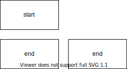
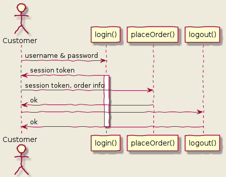
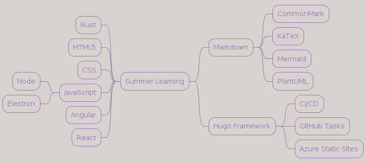
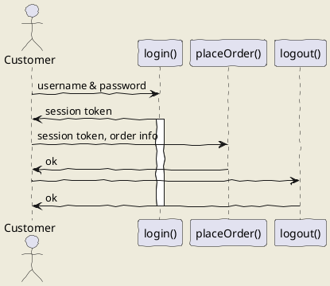
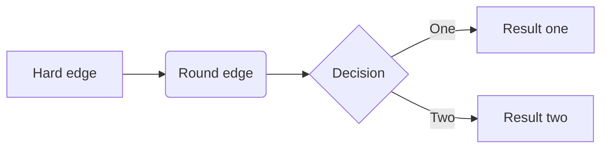
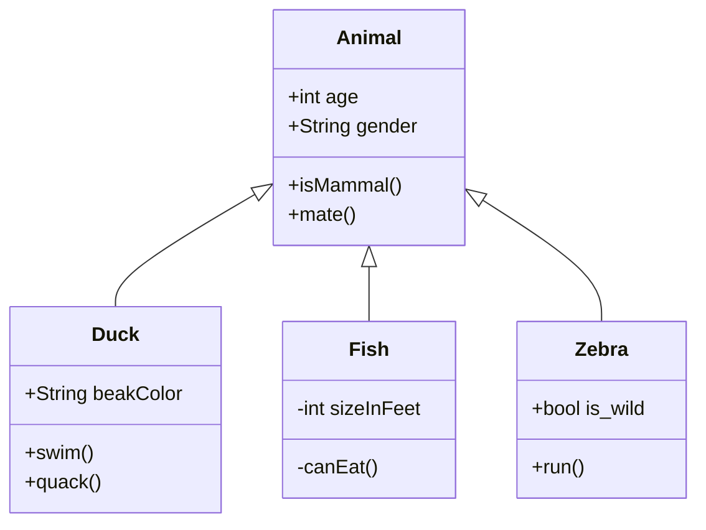
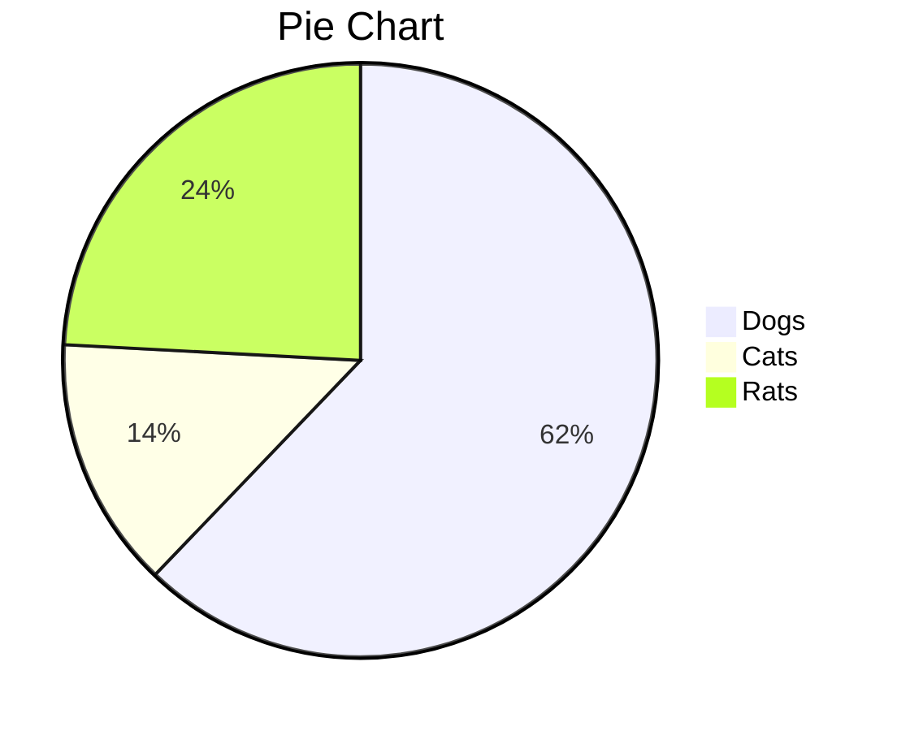
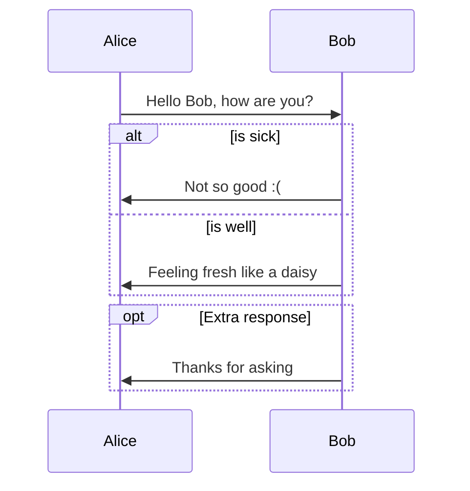
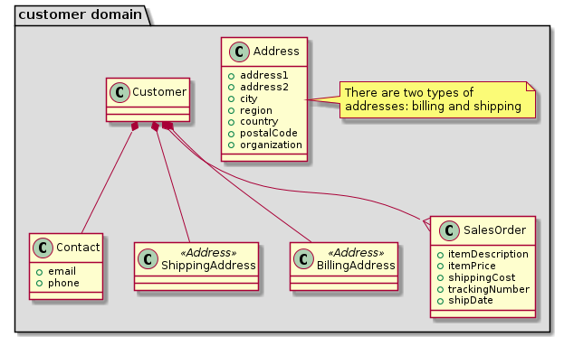

## Using markdown-memo to organize note paths

I did homework for this tab [[hw1.pdf]] it is pretty good application 

Using memo to create backlink: ![[backlink]]

Using cpp snippet


Embed photo ![[2022-03-28-11-05-56.png]]

---

## Using draw.io in vscode



---

Embed puml photo
<center> ![[out/sequences/sequences.png]] </center>

![[out/sequences/sequences.png]]


Using html with images
<center>  </center>





Using align to center images
<div style="text-align:center">
  
</div>

hello who are you

--- 
## Using UML within markdown
## uml: sequence diagram



# Hello 

This the best thing that I have done for this appliation
数据比较器
这是啥意思呢

type this thing is the best thing that I have done for this applicatoon
vscode is so op
        how do I know where to stop with this upgrading
        customer 
the best thing is that I know how to do the best typespeed is so fast 

数据选择器
这个挺好用的











<!-- <center>  -->

# uml: class diagram



# Math
$$ \begin{pmatrix} 0 \\ 0 \\ 0 \end{pmatrix} $$ 
$$ \begin{bmatrix} 0 \\ 0 \\ 0 \end{bmatrix} $$
$$ \sum_{i=1}^n X_i $$

Therefore the solution is $a$, 
$$ x = \begin{cases} 1 \\ 2 \\ 3 \end{cases} $$

$$  
\begin{darray}{rlr}
x^2 y'' - xy &= 0\\
\end{darray}  
$$

```python
print('hello world')
for element in elements:
    print(elements.first())

```


$$ \begin{vmatrix}
\end{vmatrix} $$

