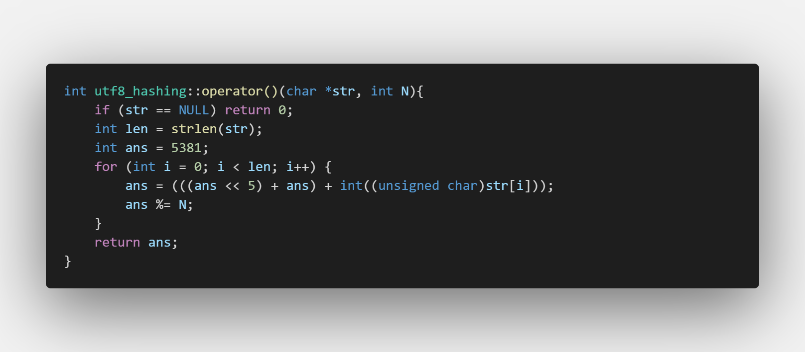

# CST LAB2 HashFun
## Background
I have changed `Makefile` to automatically generate test cases out of the two datasets given by `hdu.txt` and `poj.txt` using `generator.cpp`, and defined how to run the 9 hashing strategy combinations on the created test cases. For example, to generate tests. 
```bash
make main
make generator
make generate
```
The testcases are named `I{number of inserts}_Q{number of query}_{poj or hdu}.txt` which are located in folder `testsets/`

In order to run the 9 hashing strategies on testcase 1,
```bash
make run1
```
and the results are in `results/results.txt`

I set it so that the time limit is 10 seconds.

## Hashing Strategies

### ASCII Hashing 


I used an implementation known as bit folding, were we simply shift the next character by 7 bits so that each character is and 8 bit integer.

### UTF8 Hashing



I used the djb2 algorithm for UTF-8 encoding. 

## Collision Strategies

### Quadratic Probing


I utilized the quadratic probing algorithm as discussed in class, where we check both in positive and negative directions

### Common Overflow Area Probing


I set the common overflow area probing to be at the end of the `Table` and redefined the `table_size` for hashing to be `table_size * overflow_area`, the `overflow_area` is set to $1-.80=.20$ for testing.

## Tests and Results

The generation of the test code is created by `generator.cpp` which simply reads from `hdu.txt` and `poj.txt`, and uses `srand` to randomly insert values from each document and into the `.in` files. Every time a user id is inputed with a certain type of command, insert or query, 0 or 1, then the user is marked the same user does not inserted twice. 

The results are located in `results.txt` 

### I20000_Q15000_poj.in


### I100000_Q200000_poj.in


### I200000_Q250000_poj.in


### I20000_Q15000_hdu.in


### I100000_Q200000_hdu.in


### I200000_Q250000_hdu.in


## Analysis

1. almost all implementations of the `naive` hashing method are slower than its counter parts, which should be the case, with our restrictions of `10` seconds,most of the tests resulted in `timeout`
2. almost all implementations of the `overflow` conflict strategy resulted in worse performance than the others. 
3. `naive` + `quadratic` had better performance than `naive` + `linear` .
4. We can also see that the performance on `ascii` hashing on text `poj` had better performance than it did on `hdu`
5.  `utf8` hashing had generally better results when compared to `ascii` in all test cases as the algorithm for `utf8` has a better distribution, this is obvious when looking at the `hdu` test cases. 

## Answer Questions

1. ASCII characters are represented as the same string of bits when they are encoded instead of UTF-8, thus when comparing the algorithms, we can see that the `utf-8` algorithms work just as and even better than `ascii` hashing on the `poj` text.
2. Based on testcases such as `I20000_Q15000_poj.in` when looking at `naive` and `utf-8` we can see that quadratic is much more efficient, as well as `I100000_Q200000_poj.in` when looking at `utf-8`. However, in other cases, the performance is similar, as they probably represent worst cases, and have to traverse the entire hash table.
3. Based on our test data, closed hashing is much more efficient than open hashing. In almost all the larger test cases, the overflow area method either timeout or had the worst performance. When there are less collisions, the use of open hashing (such as the overflow) provides relatively similar similar results. 
4. It may cause an uneven distribution of the hash table, resulting in reduced hash table performance.
5. Given a dictionary (with a limited number of letters), a Trie tree can be used to find the corresponding numbers in a string. The speed of insertion and search operations is related to the length $m$ of the string, which is $O(m)$.

## Resources

1. https://medium.com/@_edhuang/how-to-hash-an-ascii-string-using-bit-folding-1f9a91b34253
2. http://www.cse.yorku.ca/~oz/hash.html
3. https://stackoverflow.com/questions/307765/how-do-i-check-if-an-objects-type-is-a-particular-subclass-in-c