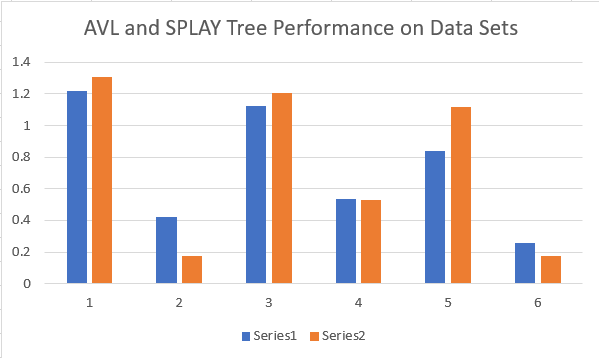

# CST LAB3 BBST

## Background
The goal of this lab is to realize the implementation of two different balanced binary search trees, where each node has a key, and supports three operations of key insertion, deletion, and search, and then compare the efficiency of those on self generated test cases. 

## Design Goals
The key difference between AVL trees and Splay trees is due to the fact that the rotation funtion of the Splay tree brings the most recently visited node to the root of the tree during lookup, thus producing faster lookups for frequently accessed data. Meanwhile, the shape of an AVL tree is strictly balanced and maintained on insertions and deletions, and does not change during lookups. Thus our test cases should focus on the idea of comparing data sets with locality and data sets with randomness.

## Test Case Generation
The code for the test case generation is located at `/testcase/generator.py` and can be run using the shell script `make.sh` in that path. First run `chmod u+x` and then `./make.sh`. There are a total of 9 different data sets, located in `testcase/tc_.txt` where `_` represents the testcase number. Testcases can also be created individually using `python generator.py _`.

In order to run the test cases and output the results, we can first compile each using `make avl` and `make splay`. Then run the code for the testcases generated by `generator.cpp` using `make runavl` and `make runsplay`, with the results outputed to `results/results.csv`.

## Test Case Design
### Testcases
1. random unsorted insertion
2. sorted insertion with segmented operation
3. first 1/3 is random insertion, last 2/3 is random insertion and deletion
4. first 1/3 is random insertion, last 2/3 is segmented random insertion and deletion has locality
5. uniform distribution of insertion/deletion/search
6. uniform distribution of insertion/deletion/search, operation has segmented intervals, operation has locality

## Analysis

From our data, we can clearly see that data sets with a strong locality has a significant impact on the performance of Splay Trees. Splay trees perform a "caching" affect, and therefore keep the frequently accessed nodes at the top of the tree, and when the "cache hit rate" is extremely high, or if there is repeated lookup, then there will be improved efficiency.

Splay trees perform with amortized $O(\log{n})$, and thus for random access patterns taken from a non-uniform random distribution, their amortized time can be faster than logarithmic. However, Splay trees have a worst case, when the splay tree organizes itself linearly, thus being $O(n)$. 

AVL trees however, take an average of $O(\log{n})$ time complexity for insertion, deletion, and lookup, and have no worst case. Thus, for the test with no locality, 1, 4, and 7, the AVL tree's strict balancing rule performs better than the Splay tree algorithm.

When running the test on OJ, the AVL tree was able to get 100/100, but the Splay only got 70. Which probably means that the data set was more randomized with less locality.

